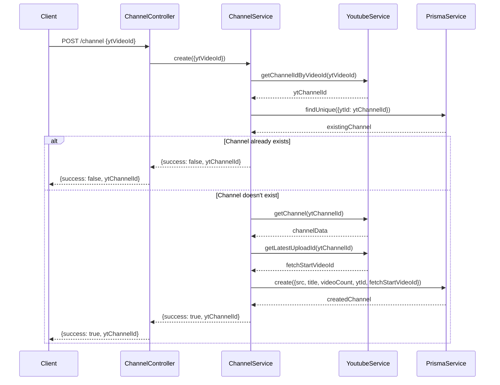

```mermaid
sequenceDiagram
    participant Client
    participant ChannelController
    participant ChannelService
    participant YoutubeService
    participant PrismaService

    Client->>ChannelController: POST /channel {ytVideoId}
    ChannelController->>ChannelService: create({ytVideoId})
    
    ChannelService->>YoutubeService: getChannelIdByVideoId(ytVideoId)
    YoutubeService-->>ChannelService: ytChannelId
    
    ChannelService->>PrismaService: findUnique({ytId: ytChannelId})
    PrismaService-->>ChannelService: existingChannel
    
    alt Channel already exists
        ChannelService-->>ChannelController: {success: false, ytChannelId}
        ChannelController-->>Client: {success: false, ytChannelId}
    else Channel doesn't exist
        ChannelService->>YoutubeService: getChannel(ytChannelId)
        YoutubeService-->>ChannelService: channelData
        
        ChannelService->>YoutubeService: getLatestUploadId(ytChannelId)
        YoutubeService-->>ChannelService: fetchStartVideoId
        
        ChannelService->>PrismaService: create({src, title, videoCount, ytId, fetchStartVideoId})
        PrismaService-->>ChannelService: createdChannel
        
        ChannelService-->>ChannelController: {success: true, ytChannelId}
        ChannelController-->>Client: {success: true, ytChannelId}
    end
```