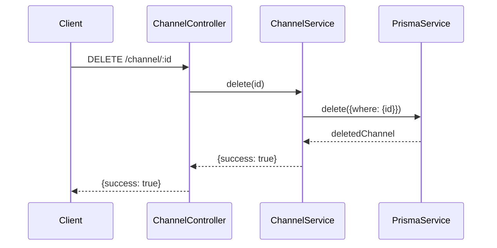

```mermaid
sequenceDiagram
    participant Client
    participant ChannelController
    participant ChannelService
    participant PrismaService

    Client->>ChannelController: DELETE /channel/:id
    ChannelController->>ChannelService: delete(id)
    
    ChannelService->>PrismaService: delete({where: {id}})
    PrismaService-->>ChannelService: deletedChannel
    
    ChannelService-->>ChannelController: {success: true}
    ChannelController-->>Client: {success: true}
```