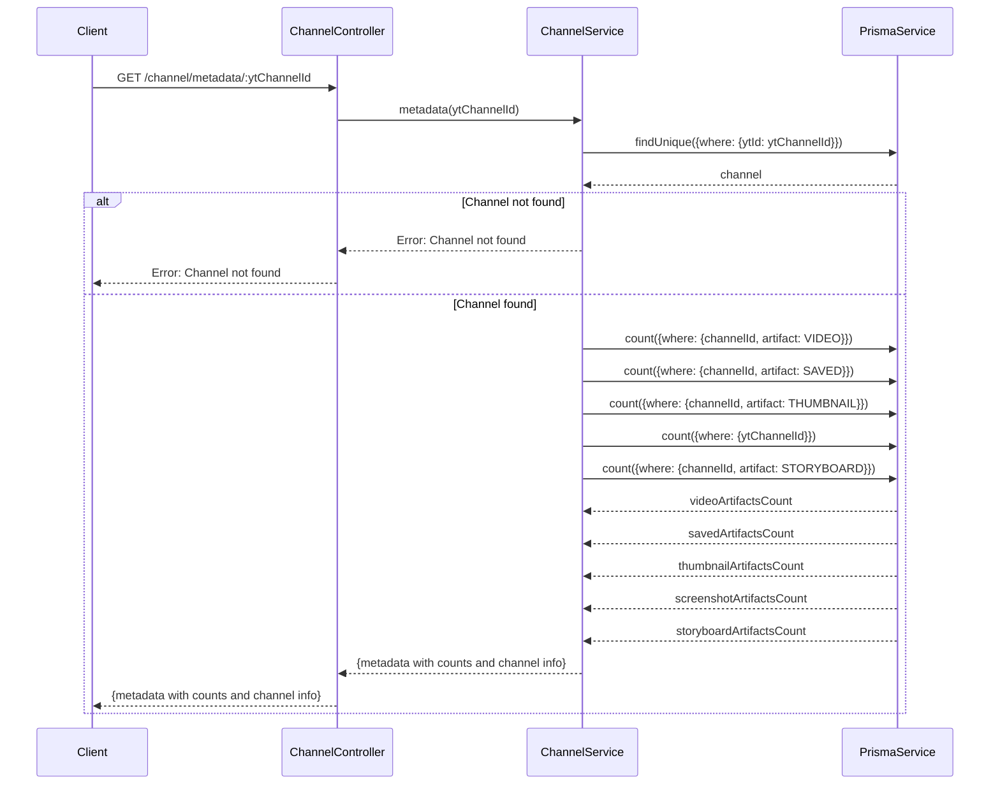

```mermaid
sequenceDiagram
    participant Client
    participant ChannelController
    participant ChannelService
    participant PrismaService

    Client->>ChannelController: GET /channel/metadata/:ytChannelId
    ChannelController->>ChannelService: metadata(ytChannelId)
    
    ChannelService->>PrismaService: findUnique({where: {ytId: ytChannelId}})
    PrismaService-->>ChannelService: channel
    
    alt Channel not found
        ChannelService-->>ChannelController: Error: Channel not found
        ChannelController-->>Client: Error: Channel not found
    else Channel found
        ChannelService->>PrismaService: count({where: {channelId, artifact: VIDEO}})
        ChannelService->>PrismaService: count({where: {channelId, artifact: SAVED}})
        ChannelService->>PrismaService: count({where: {channelId, artifact: THUMBNAIL}})
        ChannelService->>PrismaService: count({where: {ytChannelId}})
        ChannelService->>PrismaService: count({where: {channelId, artifact: STORYBOARD}})
        
        PrismaService-->>ChannelService: videoArtifactsCount
        PrismaService-->>ChannelService: savedArtifactsCount
        PrismaService-->>ChannelService: thumbnailArtifactsCount
        PrismaService-->>ChannelService: screenshotArtifactsCount
        PrismaService-->>ChannelService: storyboardArtifactsCount
        
        ChannelService-->>ChannelController: {metadata with counts and channel info}
        ChannelController-->>Client: {metadata with counts and channel info}
    end
```