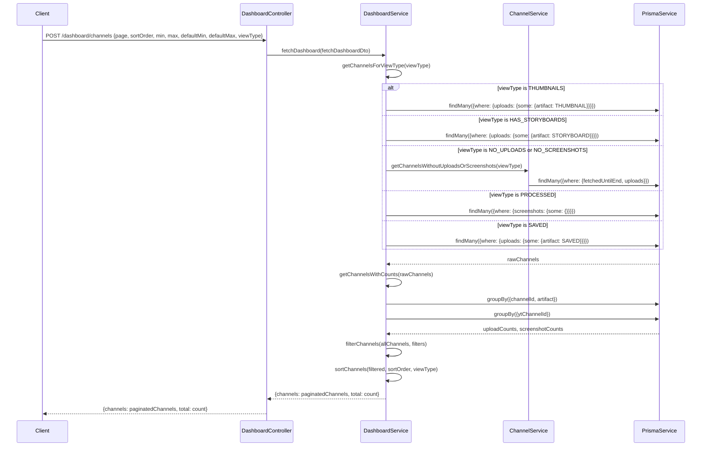

```mermaid
sequenceDiagram
    participant Client
    participant DashboardController
    participant DashboardService
    participant ChannelService
    participant PrismaService

    Client->>DashboardController: POST /dashboard/channels {page, sortOrder, min, max, defaultMin, defaultMax, viewType}
    DashboardController->>DashboardService: fetchDashboard(fetchDashboardDto)
    
    DashboardService->>DashboardService: getChannelsForViewType(viewType)
    
    alt viewType is THUMBNAILS
        DashboardService->>PrismaService: findMany({where: {uploads: {some: {artifact: THUMBNAIL}}}})
    else viewType is HAS_STORYBOARDS
        DashboardService->>PrismaService: findMany({where: {uploads: {some: {artifact: STORYBOARD}}}})
    else viewType is NO_UPLOADS or NO_SCREENSHOTS
        DashboardService->>ChannelService: getChannelsWithoutUploadsOrScreenshots(viewType)
        ChannelService->>PrismaService: findMany({where: {fetchedUntilEnd, uploads}})
    else viewType is PROCESSED
        DashboardService->>PrismaService: findMany({where: {screenshots: {some: {}}}})
    else viewType is SAVED
        DashboardService->>PrismaService: findMany({where: {uploads: {some: {artifact: SAVED}}}})
    end
    
    PrismaService-->>DashboardService: rawChannels
    
    DashboardService->>DashboardService: getChannelsWithCounts(rawChannels)
    DashboardService->>PrismaService: groupBy({channelId, artifact})
    DashboardService->>PrismaService: groupBy({ytChannelId})
    PrismaService-->>DashboardService: uploadCounts, screenshotCounts
    
    DashboardService->>DashboardService: filterChannels(allChannels, filters)
    DashboardService->>DashboardService: sortChannels(filtered, sortOrder, viewType)
    
    DashboardService-->>DashboardController: {channels: paginatedChannels, total: count}
    DashboardController-->>Client: {channels: paginatedChannels, total: count}
```