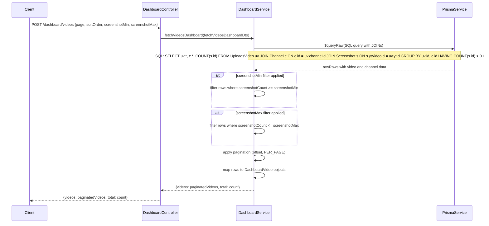

```mermaid
sequenceDiagram
    participant Client
    participant DashboardController
    participant DashboardService
    participant PrismaService

    Client->>DashboardController: POST /dashboard/videos {page, sortOrder, screenshotMin, screenshotMax}
    DashboardController->>DashboardService: fetchVideosDashboard(fetchVideosDashboardDto)
    
    DashboardService->>PrismaService: $queryRaw(SQL query with JOINs)
    Note over DashboardService,PrismaService: SQL: SELECT uv.*, c.*, COUNT(s.id) FROM UploadsVideo uv JOIN Channel c ON c.id = uv.channelId JOIN Screenshot s ON s.ytVideoId = uv.ytId GROUP BY uv.id, c.id HAVING COUNT(s.id) > 0 ORDER BY screenshotCount, uv.id DESC
    
    PrismaService-->>DashboardService: rawRows with video and channel data
    
    alt screenshotMin filter applied
        DashboardService->>DashboardService: filter rows where screenshotCount >= screenshotMin
    end
    
    alt screenshotMax filter applied
        DashboardService->>DashboardService: filter rows where screenshotCount <= screenshotMax
    end
    
    DashboardService->>DashboardService: apply pagination (offset, PER_PAGE)
    DashboardService->>DashboardService: map rows to DashboardVideo objects
    
    DashboardService-->>DashboardController: {videos: paginatedVideos, total: count}
    DashboardController-->>Client: {videos: paginatedVideos, total: count}
```