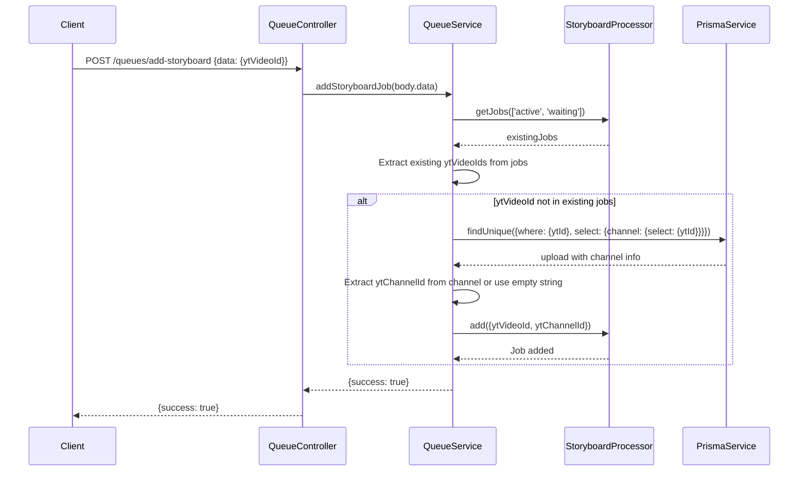

# Queue Add Storyboard Flow

```mermaid
sequenceDiagram
    participant Client
    participant QueueController
    participant QueueService
    participant StoryboardProcessor
    participant PrismaService

    Client->>QueueController: POST /queues/add-storyboard {data: {ytVideoId}}
    QueueController->>QueueService: addStoryboardJob(body.data)

    QueueService->>StoryboardProcessor: getJobs(['active', 'waiting'])
    StoryboardProcessor-->>QueueService: existingJobs

    QueueService->>QueueService: Extract existing ytVideoIds from jobs

    alt ytVideoId not in existing jobs
        QueueService->>PrismaService: findUnique({where: {ytId}, select: {channel: {select: {ytId}}}})
        PrismaService-->>QueueService: upload with channel info

        QueueService->>QueueService: Extract ytChannelId from channel or use empty string

        QueueService->>StoryboardProcessor: add({ytVideoId, ytChannelId})
        StoryboardProcessor-->>QueueService: Job added
    end

    QueueService-->>QueueController: {success: true}
    QueueController-->>Client: {success: true}
```
