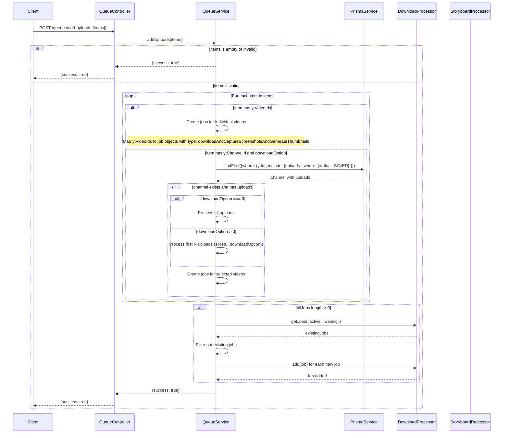

# Queue Add Uploads Flow

```mermaid
sequenceDiagram
    participant Client
    participant QueueController
    participant QueueService
    participant PrismaService
    participant DownloadProcessor
    participant StoryboardProcessor

    Client->>QueueController: POST /queues/add-uploads {items[]}
    QueueController->>QueueService: addUploads(items)

    alt items is empty or invalid
        QueueService-->>QueueController: {success: true}
        QueueController-->>Client: {success: true}
    else items is valid
        loop For each item in items
            alt item has ytVideoIds
                QueueService->>QueueService: Create jobs for individual videos
                Note over QueueService: Map ytVideoIds to job objects with type: downloadAndCaptureScreenshotsAndGenerateThumbnails
            else item has ytChannelId and downloadOption
                QueueService->>PrismaService: findFirst({where: {ytId}, include: {uploads: {where: {artifact: SAVED}}}})
                PrismaService-->>QueueService: channel with uploads

                alt channel exists and has uploads
                    alt downloadOption === 0
                        QueueService->>QueueService: Process all uploads
                    else downloadOption > 0
                        QueueService->>QueueService: Process first N uploads (slice(0, downloadOption))
                    end

                    QueueService->>QueueService: Create jobs for selected videos
                end
            end
        end

        alt allJobs.length > 0
            QueueService->>DownloadProcessor: getJobs(['active', 'waiting'])
            DownloadProcessor-->>QueueService: existingJobs

            QueueService->>QueueService: Filter out existing jobs
            QueueService->>DownloadProcessor: add(job) for each new job
            DownloadProcessor-->>QueueService: Job added
        end

        QueueService-->>QueueController: {success: true}
        QueueController-->>Client: {success: true}
    end
```
