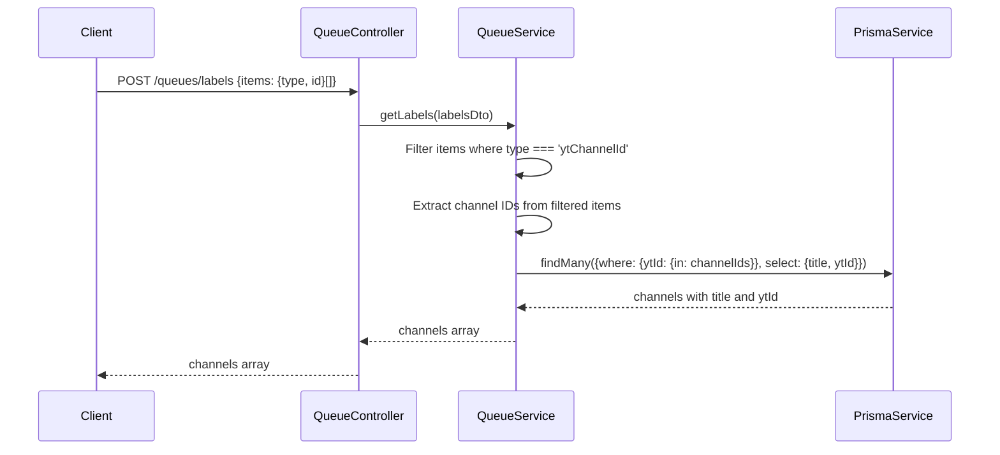

# Queue Get Labels Flow

```mermaid
sequenceDiagram
    participant Client
    participant QueueController
    participant QueueService
    participant PrismaService

    Client->>QueueController: POST /queues/labels {items: {type, id}[]}
    QueueController->>QueueService: getLabels(labelsDto)

    QueueService->>QueueService: Filter items where type === 'ytChannelId'
    QueueService->>QueueService: Extract channel IDs from filtered items

    QueueService->>PrismaService: findMany({where: {ytId: {in: channelIds}}, select: {title, ytId}})
    PrismaService-->>QueueService: channels with title and ytId

    QueueService-->>QueueController: channels array
    QueueController-->>Client: channels array
```
