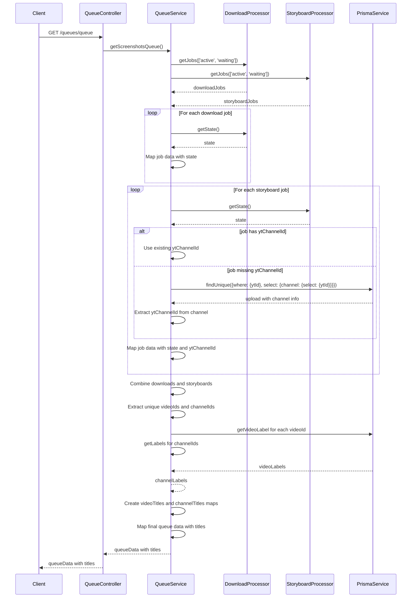

# Queue Get Screenshots Queue Flow

```mermaid
sequenceDiagram
    participant Client
    participant QueueController
    participant QueueService
    participant DownloadProcessor
    participant StoryboardProcessor
    participant PrismaService

    Client->>QueueController: GET /queues/queue
    QueueController->>QueueService: getScreenshotsQueue()

    QueueService->>DownloadProcessor: getJobs(['active', 'waiting'])
    QueueService->>StoryboardProcessor: getJobs(['active', 'waiting'])

    DownloadProcessor-->>QueueService: downloadJobs
    StoryboardProcessor-->>QueueService: storyboardJobs

    loop For each download job
        QueueService->>DownloadProcessor: getState()
        DownloadProcessor-->>QueueService: state
        QueueService->>QueueService: Map job data with state
    end

    loop For each storyboard job
        QueueService->>StoryboardProcessor: getState()
        StoryboardProcessor-->>QueueService: state

        alt job has ytChannelId
            QueueService->>QueueService: Use existing ytChannelId
        else job missing ytChannelId
            QueueService->>PrismaService: findUnique({where: {ytId}, select: {channel: {select: {ytId}}}})
            PrismaService-->>QueueService: upload with channel info
            QueueService->>QueueService: Extract ytChannelId from channel
        end

        QueueService->>QueueService: Map job data with state and ytChannelId
    end

    QueueService->>QueueService: Combine downloads and storyboards

    QueueService->>QueueService: Extract unique videoIds and channelIds

    QueueService->>PrismaService: getVideoLabel for each videoId
    QueueService->>QueueService: getLabels for channelIds

    PrismaService-->>QueueService: videoLabels
    QueueService-->>QueueService: channelLabels

    QueueService->>QueueService: Create videoTitles and channelTitles maps

    QueueService->>QueueService: Map final queue data with titles

    QueueService-->>QueueController: queueData with titles
    QueueController-->>Client: queueData with titles
```
