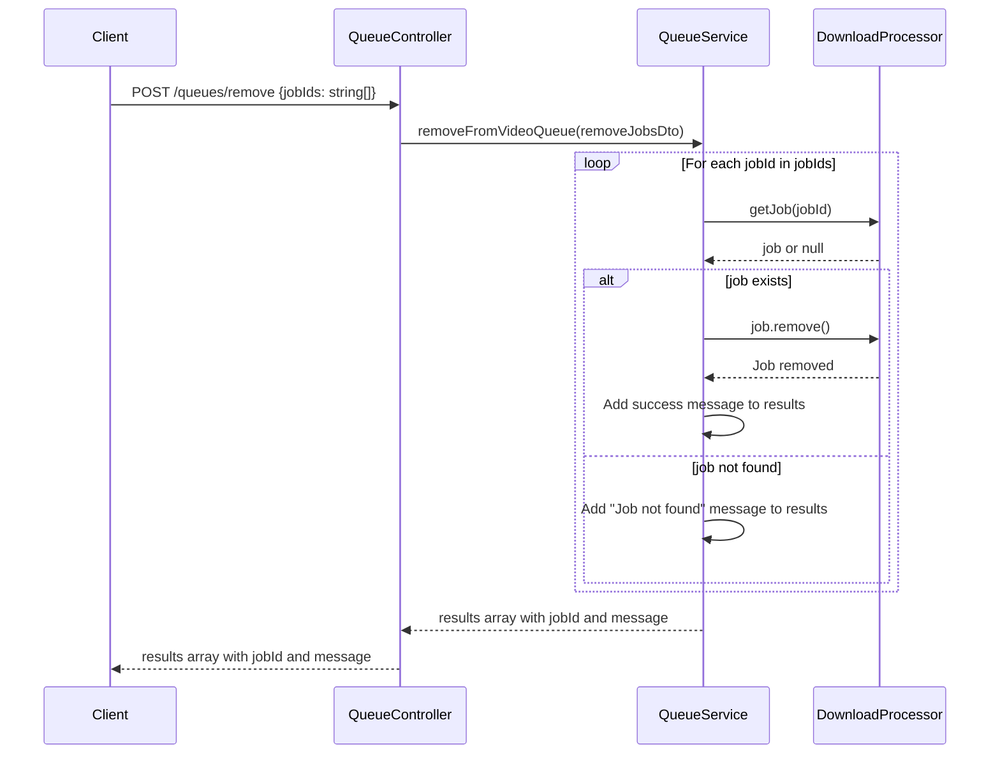

# Queue Remove From Video Queue Flow

```mermaid
sequenceDiagram
    participant Client
    participant QueueController
    participant QueueService
    participant DownloadProcessor

    Client->>QueueController: POST /queues/remove {jobIds: string[]}
    QueueController->>QueueService: removeFromVideoQueue(removeJobsDto)

    loop For each jobId in jobIds
        QueueService->>DownloadProcessor: getJob(jobId)
        DownloadProcessor-->>QueueService: job or null

        alt job exists
            QueueService->>DownloadProcessor: job.remove()
            DownloadProcessor-->>QueueService: Job removed
            QueueService->>QueueService: Add success message to results
        else job not found
            QueueService->>QueueService: Add "Job not found" message to results
        end
    end

    QueueService-->>QueueController: results array with jobId and message
    QueueController-->>Client: results array with jobId and message
```
