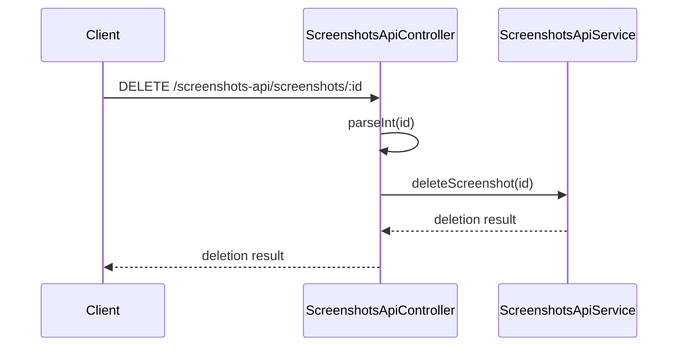

# Screenshots API Delete Screenshot Flow

```mermaid
sequenceDiagram
    participant Client
    participant ScreenshotsApiController
    participant ScreenshotsApiService

    Client->>ScreenshotsApiController: DELETE /screenshots-api/screenshots/:id
    ScreenshotsApiController->>ScreenshotsApiController: parseInt(id)
    ScreenshotsApiController->>ScreenshotsApiService: deleteScreenshot(id)
    ScreenshotsApiService-->>ScreenshotsApiController: deletion result
    ScreenshotsApiController-->>Client: deletion result
```
