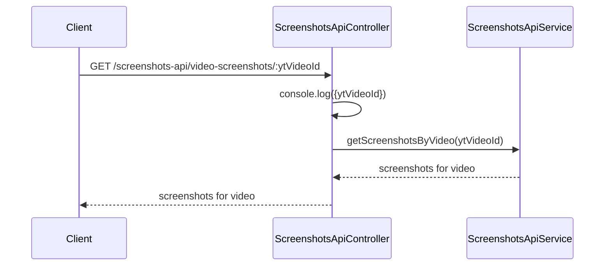

# Screenshots API Get Screenshots By Video Flow

```mermaid
sequenceDiagram
    participant Client
    participant ScreenshotsApiController
    participant ScreenshotsApiService

    Client->>ScreenshotsApiController: GET /screenshots-api/video-screenshots/:ytVideoId
    ScreenshotsApiController->>ScreenshotsApiController: console.log({ytVideoId})
    ScreenshotsApiController->>ScreenshotsApiService: getScreenshotsByVideo(ytVideoId)
    ScreenshotsApiService-->>ScreenshotsApiController: screenshots for video
    ScreenshotsApiController-->>Client: screenshots for video
```
