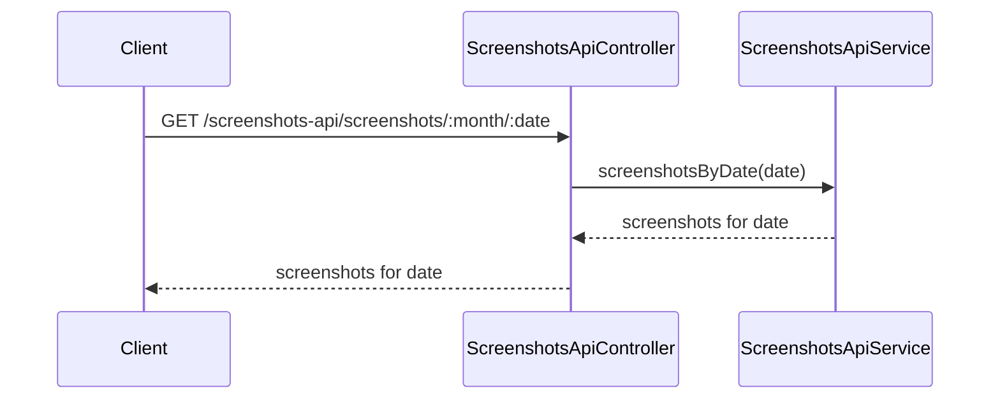

# Screenshots API Screenshots By Date Flow

```mermaid
sequenceDiagram
    participant Client
    participant ScreenshotsApiController
    participant ScreenshotsApiService

    Client->>ScreenshotsApiController: GET /screenshots-api/screenshots/:month/:date
    ScreenshotsApiController->>ScreenshotsApiService: screenshotsByDate(date)
    ScreenshotsApiService-->>ScreenshotsApiController: screenshots for date
    ScreenshotsApiController-->>Client: screenshots for date
```
