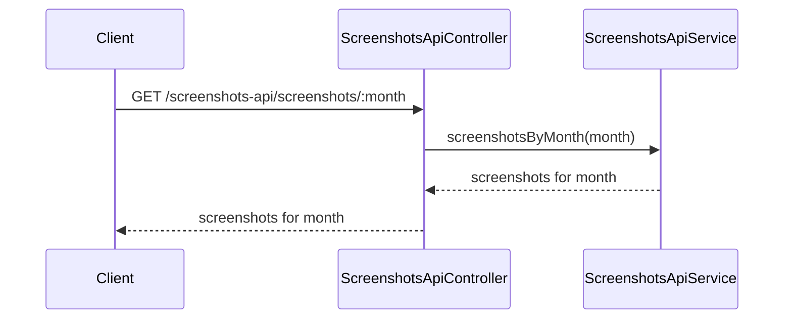

# Screenshots API Screenshots By Month Flow

```mermaid
sequenceDiagram
    participant Client
    participant ScreenshotsApiController
    participant ScreenshotsApiService

    Client->>ScreenshotsApiController: GET /screenshots-api/screenshots/:month
    ScreenshotsApiController->>ScreenshotsApiService: screenshotsByMonth(month)
    ScreenshotsApiService-->>ScreenshotsApiController: screenshots for month
    ScreenshotsApiController-->>Client: screenshots for month
```
