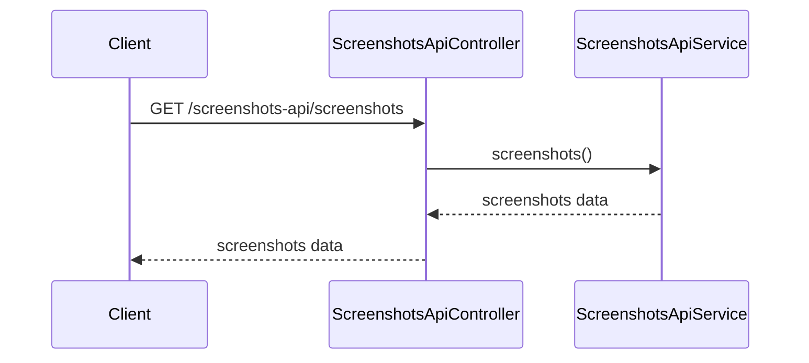

# Screenshots API Screenshots Flow

```mermaid
sequenceDiagram
    participant Client
    participant ScreenshotsApiController
    participant ScreenshotsApiService

    Client->>ScreenshotsApiController: GET /screenshots-api/screenshots
    ScreenshotsApiController->>ScreenshotsApiService: screenshots()
    ScreenshotsApiService-->>ScreenshotsApiController: screenshots data
    ScreenshotsApiController-->>Client: screenshots data
```
