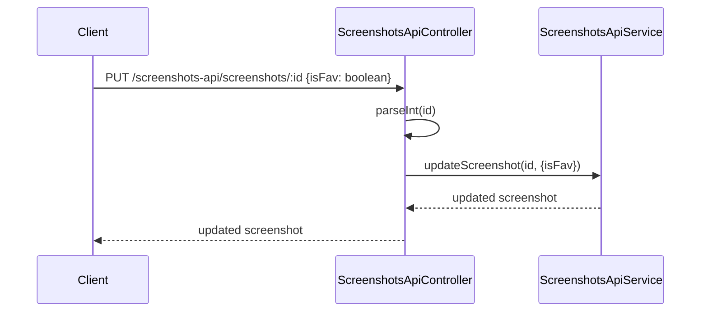

# Screenshots API Update Screenshot Flow

```mermaid
sequenceDiagram
    participant Client
    participant ScreenshotsApiController
    participant ScreenshotsApiService

    Client->>ScreenshotsApiController: PUT /screenshots-api/screenshots/:id {isFav: boolean}
    ScreenshotsApiController->>ScreenshotsApiController: parseInt(id)
    ScreenshotsApiController->>ScreenshotsApiService: updateScreenshot(id, {isFav})
    ScreenshotsApiService-->>ScreenshotsApiController: updated screenshot
    ScreenshotsApiController-->>Client: updated screenshot
```
