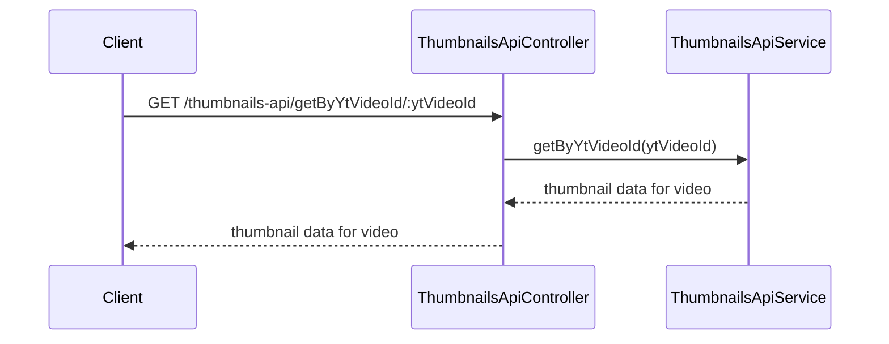

# Thumbnails API Get By YT Video ID Flow

```mermaid
sequenceDiagram
    participant Client
    participant ThumbnailsApiController
    participant ThumbnailsApiService

    Client->>ThumbnailsApiController: GET /thumbnails-api/getByYtVideoId/:ytVideoId
    ThumbnailsApiController->>ThumbnailsApiService: getByYtVideoId(ytVideoId)
    ThumbnailsApiService-->>ThumbnailsApiController: thumbnail data for video
    ThumbnailsApiController-->>Client: thumbnail data for video
```
