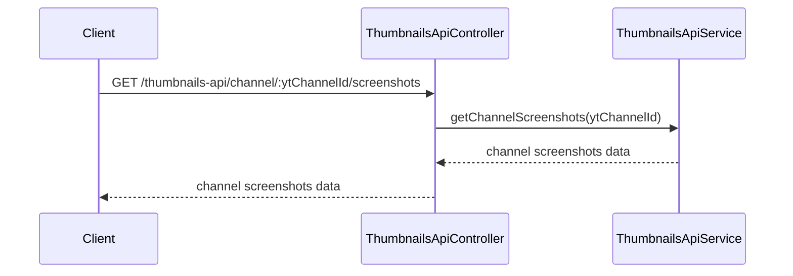

# Thumbnails API Get Channel Screenshots Flow

```mermaid
sequenceDiagram
    participant Client
    participant ThumbnailsApiController
    participant ThumbnailsApiService

    Client->>ThumbnailsApiController: GET /thumbnails-api/channel/:ytChannelId/screenshots
    ThumbnailsApiController->>ThumbnailsApiService: getChannelScreenshots(ytChannelId)
    ThumbnailsApiService-->>ThumbnailsApiController: channel screenshots data
    ThumbnailsApiController-->>Client: channel screenshots data
```
