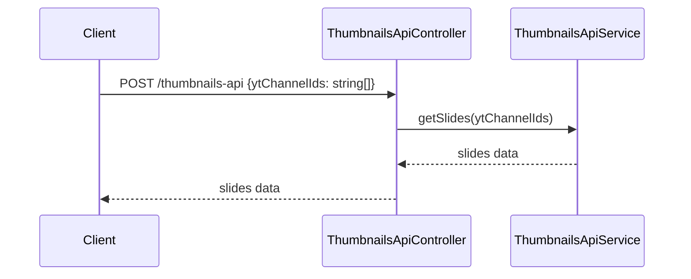

# Thumbnails API Get Slides Flow

```mermaid
sequenceDiagram
    participant Client
    participant ThumbnailsApiController
    participant ThumbnailsApiService

    Client->>ThumbnailsApiController: POST /thumbnails-api {ytChannelIds: string[]}
    ThumbnailsApiController->>ThumbnailsApiService: getSlides(ytChannelIds)
    ThumbnailsApiService-->>ThumbnailsApiController: slides data
    ThumbnailsApiController-->>Client: slides data
```
