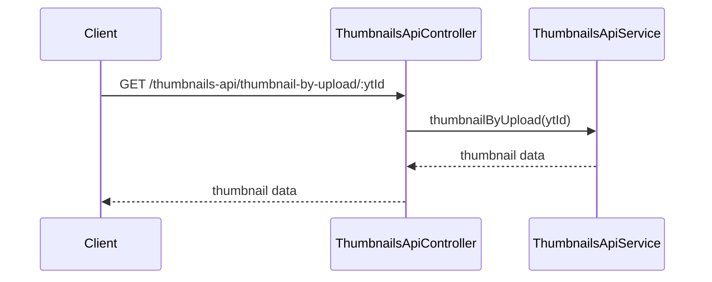

# Thumbnails API Thumbnail By Upload Flow

```mermaid
sequenceDiagram
    participant Client
    participant ThumbnailsApiController
    participant ThumbnailsApiService

    Client->>ThumbnailsApiController: GET /thumbnails-api/thumbnail-by-upload/:ytId
    ThumbnailsApiController->>ThumbnailsApiService: thumbnailByUpload(ytId)
    ThumbnailsApiService-->>ThumbnailsApiController: thumbnail data
    ThumbnailsApiController-->>Client: thumbnail data
```
