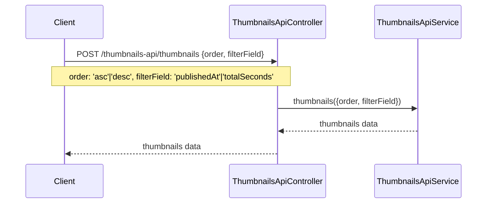

# Thumbnails API Thumbnails Flow

```mermaid
sequenceDiagram
    participant Client
    participant ThumbnailsApiController
    participant ThumbnailsApiService

    Client->>ThumbnailsApiController: POST /thumbnails-api/thumbnails {order, filterField}
    Note over Client,ThumbnailsApiController: order: 'asc'|'desc', filterField: 'publishedAt'|'totalSeconds'
    ThumbnailsApiController->>ThumbnailsApiService: thumbnails({order, filterField})
    ThumbnailsApiService-->>ThumbnailsApiController: thumbnails data
    ThumbnailsApiController-->>Client: thumbnails data
```
