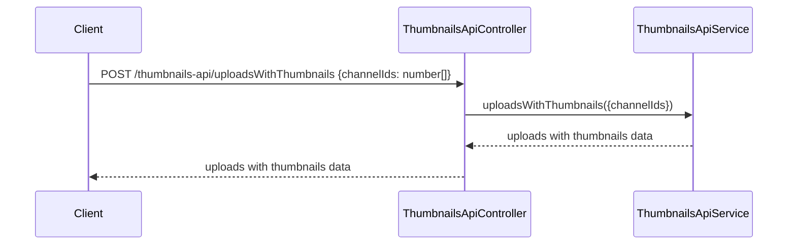

# Thumbnails API Uploads With Thumbnails Flow

```mermaid
sequenceDiagram
    participant Client
    participant ThumbnailsApiController
    participant ThumbnailsApiService

    Client->>ThumbnailsApiController: POST /thumbnails-api/uploadsWithThumbnails {channelIds: number[]}
    ThumbnailsApiController->>ThumbnailsApiService: uploadsWithThumbnails({channelIds})
    ThumbnailsApiService-->>ThumbnailsApiController: uploads with thumbnails data
    ThumbnailsApiController-->>Client: uploads with thumbnails data
```
