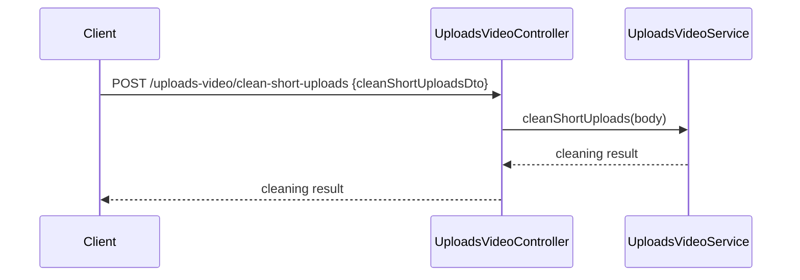

# Uploads Video Clean Short Uploads Flow

```mermaid
sequenceDiagram
    participant Client
    participant UploadsVideoController
    participant UploadsVideoService

    Client->>UploadsVideoController: POST /uploads-video/clean-short-uploads {cleanShortUploadsDto}
    UploadsVideoController->>UploadsVideoService: cleanShortUploads(body)
    UploadsVideoService-->>UploadsVideoController: cleaning result
    UploadsVideoController-->>Client: cleaning result
```
