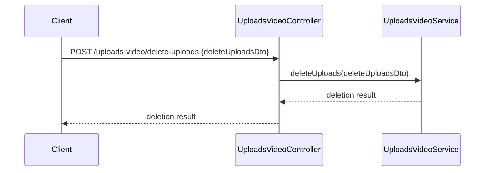

# Uploads Video Delete Uploads Flow

```mermaid
sequenceDiagram
    participant Client
    participant UploadsVideoController
    participant UploadsVideoService

    Client->>UploadsVideoController: POST /uploads-video/delete-uploads {deleteUploadsDto}
    UploadsVideoController->>UploadsVideoService: deleteUploads(deleteUploadsDto)
    UploadsVideoService-->>UploadsVideoController: deletion result
    UploadsVideoController-->>Client: deletion result
```
