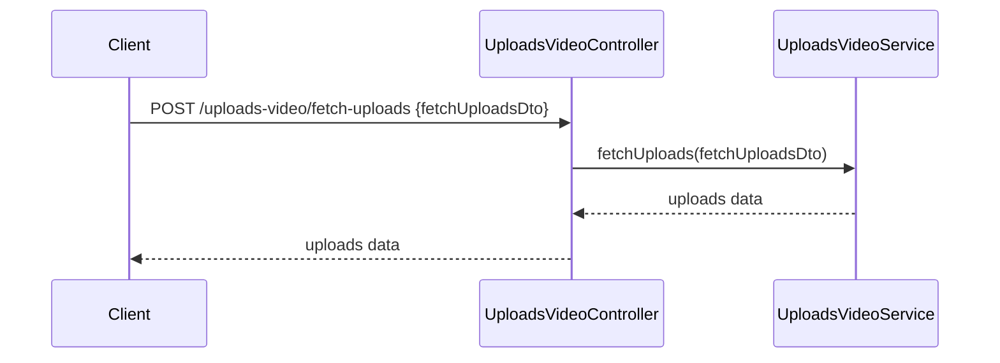

# Uploads Video Fetch Uploads Flow

```mermaid
sequenceDiagram
    participant Client
    participant UploadsVideoController
    participant UploadsVideoService

    Client->>UploadsVideoController: POST /uploads-video/fetch-uploads {fetchUploadsDto}
    UploadsVideoController->>UploadsVideoService: fetchUploads(fetchUploadsDto)
    UploadsVideoService-->>UploadsVideoController: uploads data
    UploadsVideoController-->>Client: uploads data
```
