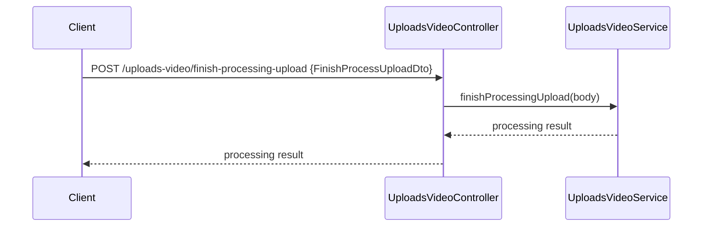

# Uploads Video Finish Processing Upload Flow

```mermaid
sequenceDiagram
    participant Client
    participant UploadsVideoController
    participant UploadsVideoService

    Client->>UploadsVideoController: POST /uploads-video/finish-processing-upload {FinishProcessUploadDto}
    UploadsVideoController->>UploadsVideoService: finishProcessingUpload(body)
    UploadsVideoService-->>UploadsVideoController: processing result
    UploadsVideoController-->>Client: processing result
```
