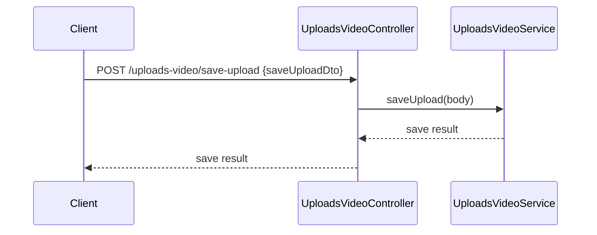

# Uploads Video Save Upload Flow

```mermaid
sequenceDiagram
    participant Client
    participant UploadsVideoController
    participant UploadsVideoService

    Client->>UploadsVideoController: POST /uploads-video/save-upload {saveUploadDto}
    UploadsVideoController->>UploadsVideoService: saveUpload(body)
    UploadsVideoService-->>UploadsVideoController: save result
    UploadsVideoController-->>Client: save result
```
