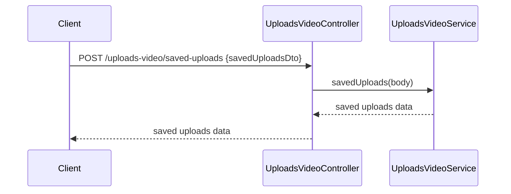

# Uploads Video Saved Uploads Flow

```mermaid
sequenceDiagram
    participant Client
    participant UploadsVideoController
    participant UploadsVideoService

    Client->>UploadsVideoController: POST /uploads-video/saved-uploads {savedUploadsDto}
    UploadsVideoController->>UploadsVideoService: savedUploads(body)
    UploadsVideoService-->>UploadsVideoController: saved uploads data
    UploadsVideoController-->>Client: saved uploads data
```
