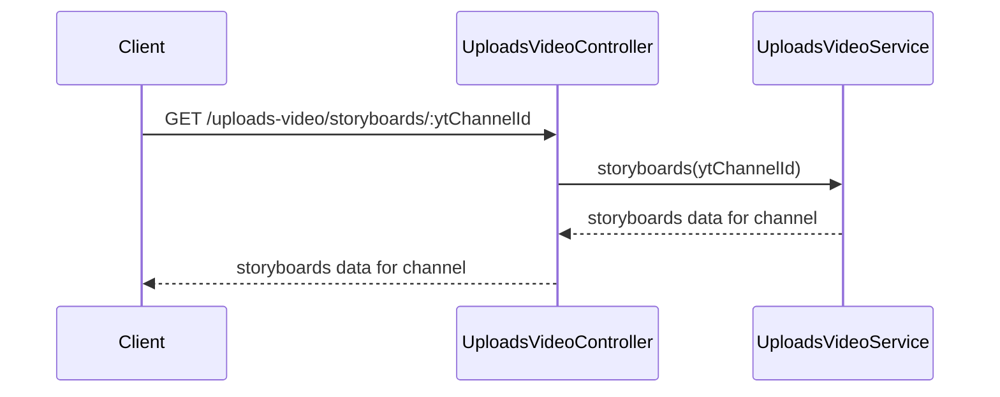

# Uploads Video Storyboards Flow

```mermaid
sequenceDiagram
    participant Client
    participant UploadsVideoController
    participant UploadsVideoService

    Client->>UploadsVideoController: GET /uploads-video/storyboards/:ytChannelId
    UploadsVideoController->>UploadsVideoService: storyboards(ytChannelId)
    UploadsVideoService-->>UploadsVideoController: storyboards data for channel
    UploadsVideoController-->>Client: storyboards data for channel
```
