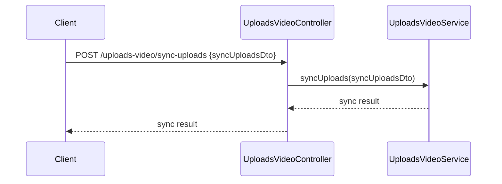

# Uploads Video Sync Uploads Flow

```mermaid
sequenceDiagram
    participant Client
    participant UploadsVideoController
    participant UploadsVideoService

    Client->>UploadsVideoController: POST /uploads-video/sync-uploads {syncUploadsDto}
    UploadsVideoController->>UploadsVideoService: syncUploads(syncUploadsDto)
    UploadsVideoService-->>UploadsVideoController: sync result
    UploadsVideoController-->>Client: sync result
```
