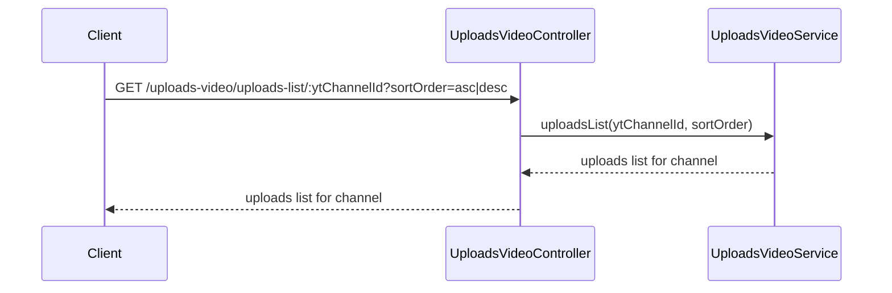

# Uploads Video Uploads List Flow

```mermaid
sequenceDiagram
    participant Client
    participant UploadsVideoController
    participant UploadsVideoService

    Client->>UploadsVideoController: GET /uploads-video/uploads-list/:ytChannelId?sortOrder=asc|desc
    UploadsVideoController->>UploadsVideoService: uploadsList(ytChannelId, sortOrder)
    UploadsVideoService-->>UploadsVideoController: uploads list for channel
    UploadsVideoController-->>Client: uploads list for channel
```
