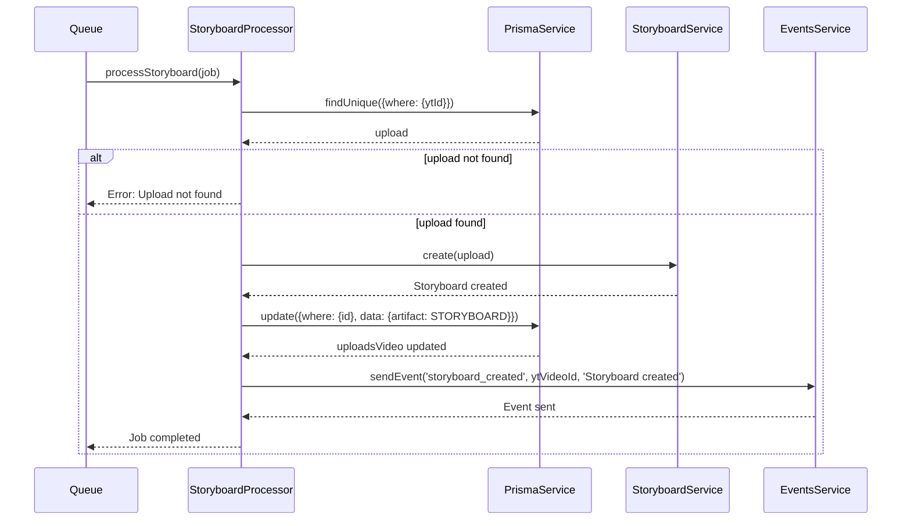

# Video Worker Storyboard Processor Flow

```mermaid
sequenceDiagram
    participant Queue
    participant StoryboardProcessor
    participant PrismaService
    participant StoryboardService
    participant EventsService

    Queue->>StoryboardProcessor: processStoryboard(job)

    StoryboardProcessor->>PrismaService: findUnique({where: {ytId}})
    PrismaService-->>StoryboardProcessor: upload

    alt upload not found
        StoryboardProcessor-->>Queue: Error: Upload not found
    else upload found
        StoryboardProcessor->>StoryboardService: create(upload)
        StoryboardService-->>StoryboardProcessor: Storyboard created

        StoryboardProcessor->>PrismaService: update({where: {id}, data: {artifact: STORYBOARD}})
        PrismaService-->>StoryboardProcessor: uploadsVideo updated

        StoryboardProcessor->>EventsService: sendEvent('storyboard_created', ytVideoId, 'Storyboard created')
        EventsService-->>StoryboardProcessor: Event sent

        StoryboardProcessor-->>Queue: Job completed
    end
```
