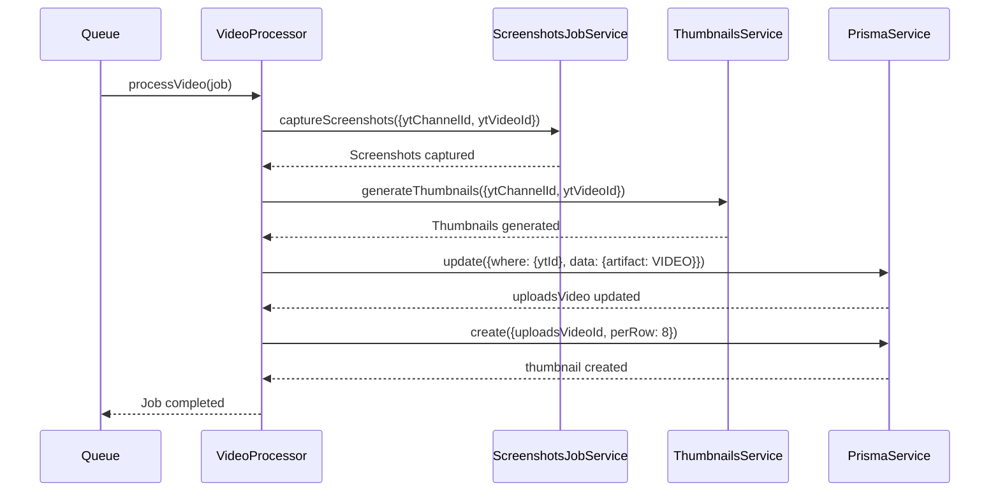

# Video Worker Video Processor Flow

```mermaid
sequenceDiagram
    participant Queue
    participant VideoProcessor
    participant ScreenshotsJobService
    participant ThumbnailsService
    participant PrismaService

    Queue->>VideoProcessor: processVideo(job)

    VideoProcessor->>ScreenshotsJobService: captureScreenshots({ytChannelId, ytVideoId})
    ScreenshotsJobService-->>VideoProcessor: Screenshots captured

    VideoProcessor->>ThumbnailsService: generateThumbnails({ytChannelId, ytVideoId})
    ThumbnailsService-->>VideoProcessor: Thumbnails generated

    VideoProcessor->>PrismaService: update({where: {ytId}, data: {artifact: VIDEO}})
    PrismaService-->>VideoProcessor: uploadsVideo updated

    VideoProcessor->>PrismaService: create({uploadsVideoId, perRow: 8})
    PrismaService-->>VideoProcessor: thumbnail created

    VideoProcessor-->>Queue: Job completed
```
